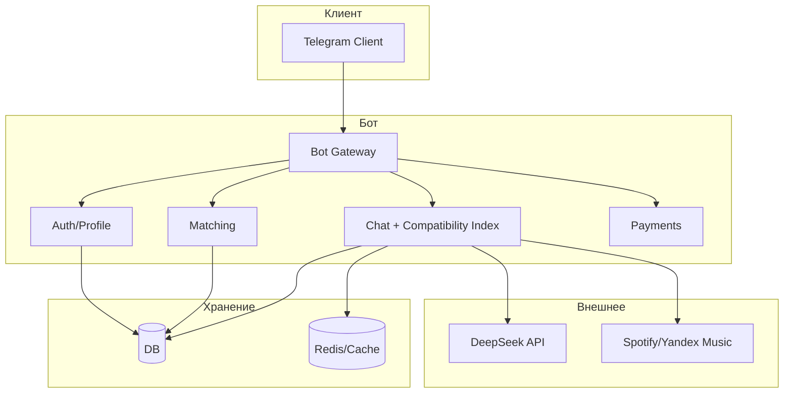

# Спецификация телеграм-бота для знакомств

**Версия:** 1.2  
**Дата:** 2025-03-08

---

## 0. Глоссарий

| Термин | Определение |
|--------|-------------|
| **Индекс совместимости** | Динамический показатель совместимости пары (0–100%), рассчитываемый по переписке; определяет уровень и разблокируемые функции. |
| **Пара (матч)** | Два пользователя, взаимно поставившие лайк; между ними создаётся чат и начинает считаться индекс. |
| **Уровень** | Порог индекса (0–15%, 16–30%, … 91–100%), от которого зависят статус пары и доступные фичи. |
| **Разблокировка** | Открытие функции при достижении уровня: плейлист, челленджи, облако воспоминаний, голосование, PDF. |
| **Бустер** | Платная временная опция ускорения роста индекса (например, x2 на 24 ч). |
| **DeepSeek API** | Единственный разрешённый в проекте ИИ-провайдер; используется для PRO-анализа диалогов, генерации вопросов и рекомендаций. |
| **Язык интерфейса (локаль)** | Выбор пользователя: русский или английский; определяет язык всех текстов бота (меню, подсказки, уведомления). |
| **Геолокация** | Координаты пользователя (широта/долгота), передаваемые по желанию через Telegram; используются для показа в ленте ближайших пользователей и расстояния до них (в км). |
| **Расстояние до пользователя** | Расстояние от текущего пользователя до карточки в ленте, вычисляемое по координатам (например, формула Haversine); отображается приближённо (например, «~2 км», «~15 км») для конфиденциальности. |

---

## 1. Цели и целевая аудитория

- **Цель**: знакомства через Telegram с игровой механикой совместимости («Индекс совместимости»), удержание за счёт прогресса в паре и разблокировки уровней.
- **Аудитория**: пользователи 18+, ищущие лёгкие знакомства или отношения; важна вовлечённость в переписку, а не только свайпы.

---

## 2. Архитектура продукта (высокоуровнево)

- **Вход**: только Telegram (Bot API). Рекомендуется **webhook** для продакшена (низкая задержка); long polling — для разработки. Учитывать повторную доставку обновлений Telegram (идемпотентная обработка по `update_id`).
- **Бэкенд**: сервер бота (Node.js/Python/Go), БД (профили, пары, сообщения, метрики индекса), кэш и очереди (см. ниже).
- **Внешние сервисы**: для ИИ-анализа — **только DeepSeek API** (другие LLM не используются); опционально API музыки для плейлистов по совместимости.

### 2.1 Очередь сообщений

- Ввести **очередь** (Redis Streams / RabbitMQ / Kafka и т.п.) для:
  - расчёта Индекса Судьбы после нового сообщения;
  - отправки уведомлений («Спасите индекс», рост уровня);
  - вызовов внешних API (DeepSeek API, музыка) без блокировки ответа пользователю.
- Обеспечивает повтор при сбоях и развязку приёма сообщений от тяжёлой обработки.

### 2.2 Хранилище медиа

- **Фото, голосовые**: получение через Telegram Bot API; при необходимости долгого хранения — сохранение в объектное хранилище (S3-совместимое), иначе — только проксирование без постоянного хранения.
- Явно зафиксировать **политику хранения и удаления** медиа в соответствии с разделом 6 (срок хранения данных).

### 2.3 Роль Redis

- **Кэш**: текущий индекс пары, последние N сообщений для расчёта (TTL 1–24 ч в зависимости от сценария); инвалидация при новом сообщении в чате.
- **Сессии/контекст**: текущий экран пользователя (лента / чат X) при необходимости.
- **Очереди**: при выборе Redis Streams — очереди задач (расчёт индекса, уведомления).
- Критичные для консистентности данные (итоговый процент, флаги разблокировок) дублировать в БД; при рестарте Redis — восстановление из БД.

### 2.4 Масштабирование

- **Горизонтальное масштабирование**: несколько инстансов бота за балансировщиком; состояние — в БД/Redis, не в памяти процесса.
- **Воркеры расчёта индекса**: отдельный пул воркеров, потребляющих очередь; масштабирование по длине очереди.

### 2.5 API-слой (опционально)

- При появлении веб-админки, партнёрских интеграций или мобильного приложения — выделить REST API (или webhook’и) с аутентификацией и версионированием; граница между «Telegram-бот» и внутренними сервисами остаётся чёткой.

---

## 3. Базовый функционал бота (без Индекса Судьбы)

### 3.1 Регистрация и верификация

- Вход по Telegram (id, username, имя, фото).
- **Выбор языка интерфейса**: при первом запуске (или в настройках) пользователь выбирает язык — **русский** или **английский**. Все тексты бота (меню, кнопки, подсказки, уведомления, системные сообщения) отображаются на выбранном языке. Смена языка доступна в настройках профиля в любой момент.
- Минимальный возраст 18+ (дата рождения или подтверждение).
- Согласие с правилами и обработкой данных.

### 3.2 Анкета пользователя

- **Обязательно**: имя/ник, возраст, пол, кого ищет (М/Ж/все), город или «не указывать», одно фото.
- **Опционально**: краткое описание, интересы (теги), любимые фильмы/сериалы/музыка (для лексического анализа Индекса Судьбы), знак зодиака.
- **Геолокация (опционально)**: пользователь может поделиться местоположением (через кнопку Telegram «Отправить геолокацию» или выбор на карте). Координаты сохраняются для расчёта расстояний; пользователь может в любой момент отключить геолокацию или обновить её. Без геолокации карточки в ленте показываются без расстояния и не приоритизируются по близости.
- Редактирование анкеты в любой момент.

### 3.3 Поиск и матчинг

- **Лента**: карточки по фильтрам (возраст, пол, город). Пользователи видят **ближайших пользователей** (при включённой геолокации у обоих — сортировка по расстоянию) и **расстояние до каждого** (например, «~2 км», «~15 км»); точные координаты и адреса не раскрываются. У карточек пользователей без геолокации расстояние не показывается. Свайп вправо — лайк, влево — пропуск.
- **Взаимный лайк** → создаётся пара (чат), оба получают уведомление.
- Ограничение количества лайков в день (например, 10 бесплатно) + расширение за донат/подписку.

### 3.4 Чаты

- Личный чат только между парой (после матча). Сообщения идут через бота: пользователь пишет боту в контексте «чат с пользователем X», бот пересылает сообщение партнёру (без раскрытия контактов до разблокировки).
- Поддержка: текст, фото, голосовые, стикеры, гифки (по правилам платформы).
- При необходимости — жалобы, блокировка, **завершение чата** (кнопка «Завершить чат»): статус пары переводится в «завершён», индекс для этой пары больше не обновляется. **После завершения чата оба пользователя снова появляются в ленте друг у друга**; при повторном взаимном лайке создаётся новый матч (новый чат) с новым индексом совместимости.

---

## 4. Индекс совместимости 2.0 (из feature.md)

Фича встроена в чаты: у каждой пары свой **текущий индекс** (0–100%) и **уровень**, от которого зависят разблокируемые функции.

### 4.1 Визуал в чате

- В шапке/описании чата: прогресс-бар и процент, например:  
  `Анна (23) ● Совместимость: [█████░░░░░] 47%`  
  плюс подсказка: «+3% за обсуждение музыки | До 50% осталось 1 сообщение».
- При росте индекса — служебное сообщение от бота с эффектом (например, рамка из символов и текст «ИНДЕКС СУДЬБЫ ПОВЫШЕН» + причина + новый процент).

### 4.2 Механика расчёта (4 уровня)

| Уровень              | Суть                                         | Примеры                                                                                                                                                                                         |
| -------------------- | -------------------------------------------- | ----------------------------------------------------------------------------------------------------------------------------------------------------------------------------------------------- |
| **1. Лексический**   | Слова-маркеры по категориям                  | Общие интересы (+2–5%), глубинные темы (+3–7%), юмор (+1–3%), комплименты (+1–2%), музыка/кино при совпадении (+2–4%).                                                                          |
| **2. Поведенческий** | Длина сообщений, скорость ответов, голосовые | Быстрые ответы (<2 мин) — бонус раз в час +1%; молчание >24 ч — −0.5%/час; односложные ответы тормозят рост; сообщения >100 символов — микро-бонус; первое голосовое +5%; голосовое >1 мин +2%. |
| **3. Эмоциональный** | Тон (NLP/эвристики)                          | Позитив (восклицания, смайлы, поддержка) — рост; негатив/сарказм/споры — заморозка или падение; флирт (комплименты, подколы, эмодзи) — множитель x1.5.                                            |
| **4. Синхронность**  | «Магия данных»                               | Одинаковое время активности (например, оба в 2 ночи) +3%; похожие паттерны сна +2%; симметричные паузы перед ответом +2%.                                                                       |

### 4.3 Система уровней и разблокировки

| Индекс  | Статус пары        | Что открывается                                                                                          |
| ------- | ------------------ | -------------------------------------------------------------------------------------------------------- |
| 0–15%   | Незнакомцы         | Обычный чат                                                                                              |
| 16–30%  | Знакомые           | Общий плейлист (ссылка Spotify/Яндекс.Музыка по общим трекам)                                            |
| 31–50%  | Близкие по духу    | Режим челленджа: бот даёт задания («Спроси, какую суперсилу хотел бы»)                                   |
| 51–70%  | Потенциальная пара | «Облако воспоминаний» — сохранение смешных/милых моментов переписки                                      |
| 71–90%  | Половина           | Анонимное голосование по шкалам (юмор, доброта, внешность); результаты видны после взаимного голосования |
| 91–100% | Идеальная пара     | Секрет: PDF «История нашей любви» (таймлайн, лучшие фразы, зодиак) или сертификат на свидание             |

### 4.4 Сценарии вовлечения

- **«Гонка за 100%»**: подсказки «до 70% осталось N сообщений» мотивируют углублять диалог.
- **«Спасите индекс»**: при падении из-за отсутствия партнёра >6 ч — уведомление с предложением отправить стикер или голосовое.
- **«Конфликт»**: при мате/явном негативе — заморозка индекса на 3 часа + сообщение про паузу или извинение.

### 4.5 Техническая реализация (MVP vs PRO)

- **MVP**: ключевые слова (база 500+ фраз с весами), `len(text)`, тайм-трекер сообщений, подсчёт эмодзи (❤️🔥😍 vs 😠👿). Без вызова внешнего API.
- **PRO**: запрос к **DeepSeek API** (единственный разрешённый ИИ-провайдер) с промптом вида: «Проанализируй диалог двух людей. Верни JSON: совместимость_процент, причина_роста, рекомендация_для_диалога.»

### 4.6 Модель обработки и консистентность расчёта индекса

- **Режим обработки**: для MVP — расчёт индекса **по событию** (новое сообщение попадает в очередь, воркер пересчитывает индекс и сохраняет в БД/Redis). Целевая задержка обновления индекса — не более 30–60 сек (зависит от длины очереди). Батч-режим (раз в N минут по всем активным парам) — опционально для фона (например, падение из-за молчания).
- **Идемпотентность**: каждое событие (например, «сообщение message_id доставлено») обрабатывается по уникальному ключу (message_id или update_id). Повторная доставка из очереди или от Telegram не должна дважды увеличивать индекс.
- **Краевые случаи**:
  - Удаление пользователем сообщения: не пересчитывать индекс в сторону отката (или учесть политику «удалённые не участвуют в расчёте» и пересчитать один раз).
  - Блокировка или завершение чата во время расчёта: проверка статуса пары перед записью нового процента; при статусе «завершён»/«заблокирован» не обновлять индекс.
  - Завершение чата: статус пары «завершён», индекс не обновляется, партнёры снова отображаются в ленте друг у друга (см. п. 3.4).
- **PRO / DeepSeek API**: таймаут запроса (например, 10 сек), лимит запросов на пару в единицу времени (защита от перерасхода). При недоступности или таймауте DeepSeek API — **fallback** на MVP-логику (эвристики, ключевые слова, эмодзи); не блокировать обновление индекса. Ограничение месячного бюджета на вызовы DeepSeek по среде (конфиг).

---

## 5. Монетизация

- **Базовая**: ограничение лайков в день; разблокировка дополнительных лайков или «суперлайков» за звёзды Telegram / подписку.
- **Индекс совместимости** (из feature.md):
  - **Ускоритель**: донат (например, 50 звёзд) — «Бустер совместимости» на 24 ч (рост индекса x2).
  - **Секретный вопрос**: покупка анонимного вопроса от ИИ, ответ на который даёт гарантированный рост индекса.
  - **Детектор искренности**: платная функция — «искренность собеседника в последних 5 сообщениях».
  - **Аналитика**: отчёт в духе «Ты нравишься собеседнику на 82%, но часто используешь слово „короче“».

---

## 6. Данные и хранение

- **Профили**: user_id, демография, анкета, настройки (в т.ч. **язык интерфейса** — русский/английский), подписка/баланс звёзд; при согласии пользователя — **геолокация** (широта, долгота, дата последнего обновления) для расчёта расстояний и приоритета «ближайшие» в ленте.
- **Пары**: match_id, user_1, user_2, created_at, статус (активен/заблокирован/завершён).
- **Сообщения**: для расчёта индекса — текст (или хэш), тип (текст/голос/стикер), длина, timestamp, отправитель; хранить только нужный минимум и агрегаты.
- **Индекс совместимости**: пара_id, текущий_процент, история изменений (по желанию — помесячно/по уровням), последние события (причина роста/падения), флаги разблокировок (плейлист, челленджи, облако, голосование, PDF).
- **Геймификация**: достижения по парам, разблокированные челленджи, «облако воспоминаний» (ссылки на сообщения или цитаты).

### 6.1 Схема БД (ключевые сущности и индексы)

- **users**: id (PK), telegram_id (unique), locale (язык интерфейса: ru/en), latitude, longitude (nullable — геолокация по желанию), location_updated_at (nullable), created_at, deleted_at (soft delete). Индексы: telegram_id; для выборки «ближайших» — пространственный индекс (PostGIS/PostgreSQL) или составной (latitude, longitude) с учётом расчёта расстояния (Haversine).
- **matches**: id (PK), user_1_id, user_2_id, created_at, status. Индексы: (user_1_id, user_2_id), status, created_at.
- **messages**: id (PK), match_id, sender_id, type, length, created_at; при необходимости — text_hash или усечённый текст. Индексы: (match_id, created_at) для выборки по паре и времени.
- **destiny_index**: match_id (PK), current_percent, updated_at, flags (плейлист, челленджи, облако, голосование, pdf). Индексы: updated_at при необходимости батч-обработки.
- **destiny_events** (опционально): id, match_id, delta, reason, created_at — для истории изменений.

### 6.2 Срок хранения данных

- **Геолокация**: хранить только актуальные координаты (текущая позиция); история перемещений не ведётся. При отключении пользователем геолокации — обнуление полей (latitude, longitude) или пометка «не показывать».
- **Сообщения (сырые)**: хранить не более N месяцев (например, 12) для расчёта индекса и модерации; после — только агрегаты и цитаты в «облаке воспоминаний» при согласии пользователей.
- **История индекса**: агрегаты по уровням/помесячно — по желанию бессрочно или в рамках срока хранения аккаунта.
- Соответствие политике конфиденциальности и праву на забвение — см. п. 6.3.

### 6.3 Удаление аккаунта (GDPR, право на забвение)

- **Процедура**: по запросу пользователя — каскадное удаление или анонимизация: профиль, лайки, пары (с уведомлением второго пользователя «собеседник удалил аккаунт»), сообщения и метрики индекса по этим парам.
- **Срок**: «мягкое» удаление (deleted_at) с периодом восстановления (например, 30 дней), затем безвозвратное удаление или анонимизация.
- В онбординге и в настройках — явная кнопка «Удалить аккаунт» и ссылка на политику конфиденциальности.

### 6.4 Резервное копирование и восстановление

- **Бэкапы БД**: регулярные (ежедневно минимум); хранение копий с учётом RPO (допустимая потеря данных) и RTO (время восстановления).
- **Восстановление**: регламент проверки восстановления из бэкапа; при использовании Redis — возможность пересчитать кэш из БД после сбоя.

---

## 7. Безопасность и модерация

- Запрет на передачу контактов до согласованного уровня (например, до «Идеальная пара» или отдельная опция).
- **Геолокация**: хранение координат только при явном согласии пользователя; в ленте показывать только **приближённое расстояние** (например, округление до целых км или диапазон «менее 5 км»), не точный адрес и не координаты. Пользователь может отключить геолокацию в настройках — тогда его позиция не используется, а в ленте для других он отображается без расстояния. При удалении аккаунта координаты удаляются.
- Автоматическая фильтрация оскорблений/спам-маркеров (связь с заморозкой индекса).
- Жалобы: блок пользователя, проверка модератором, возможное отключение Индекса Судьбы для нарушителей.
- Хранение персональных данных и логов в соответствии с политикой конфиденциальности (явное согласие в онбординге).

### 7.1 Ограничение передачи контактов

- **Технически**: до разблокировки уровня не отдавать контактные данные (номер, username Telegram при необходимости скрывать). В чате — общение только через бота, пересылка сообщений без раскрытия контакта.
- **Модерация**: автоматическая проверка текста на маркеры обмена контактами (номера телефонов, соцсети, ссылки на личные профили); при обнаружении — предупреждение или ограничение (например, заморозка индекса). Жалобы пользователей — ручная проверка модератором.

### 7.2 Шифрование и передача данных

- **Транспорт**: весь трафик к бэкенду и к внешним API — по TLS (HTTPS, wss при webhook).
- **Хранение**: чувствительные поля (при необходимости) — шифрование в покое (например, токены OAuth музыки) с управлением ключами (KMS или секреты в среде).

### 7.3 Защита от злоупотреблений

- **Rate limiting**: лимиты на количество запросов по user_id и по чату (сообщений в минуту/час), на запросы к ленте и лайкам; при превышении — временная блокировка или капча (если реализуема в Telegram).
- **Антиспам**: обнаружение однотипных сообщений, флуда; связь с заморозкой индекса и предупреждениями.
- **Антибот**: при подозрительной активности (массовые лайки, однотипные анкеты) — дополнительная верификация или ограничение функционала.

### 7.4 Логирование и аудит

- Логировать события для расследования жалоб и инцидентов: матчи, блокировки, жалобы, смена статуса пары. **Не** хранить в логах полный текст сообщений (только id, тип, длина при необходимости); доступ к логам — только для модерации и инцидент-менеджмента.
- Срок хранения логов — в соответствии с политикой конфиденциальности (например, 90–180 дней).

---

## 8. Внешние интеграции

- **ИИ-анализ (обязательное ограничение)**: в качестве API для ИИ разрешён **только DeepSeek API**. Использование других LLM (OpenAI, Anthropic, YandexGPT, локальных моделей и т.д.) не допускается. Все сценарии PRO (анализ диалога, секретный вопрос, детектор искренности, аналитика) реализуются исключительно через DeepSeek API.
- **Telegram Bot API**: webhook vs long polling — см. п. 2; учитывать лимиты Telegram по частоте запросов (throttling), повторные доставки обновлений — идемпотентная обработка по `update_id`.
- **Музыка (Spotify / Яндекс.Музыка)**: авторизация по OAuth 2.0; хранение и обновление refresh-токенов в защищённом виде. Учитывать квоты API; при исчерпании квоты — корректное сообщение пользователю («плейлист временно недоступен») без падения сервиса.
- **DeepSeek API (PRO)**: см. п. 4.6 (таймауты, fallback, лимиты затрат).

---

## 9. Нефункциональные требования

- **Доступность**: целевой показатель — например, 99,5% uptime (допустимое простое в месяц — в пределах SLA).
- **Задержка**: ответ бота пользователю (доставка сообщения партнёру, обновление ленты) — p95 не более 2–3 сек; обновление индекса — см. п. 4.6 (30–60 сек).
- **Мониторинг и алертинг**: метрики (латентность, ошибки, длина очереди расчёта индекса, доступность БД/Redis и внешних API); алерты при деградации и сбоях с уведомлением ответственных.
- **Оценка нагрузки** (для выбора инфраструктуры): на этапе проектирования зафиксировать порядок величин — ожидаемое число пользователей, пар, сообщений в сутки; исходя из этого — выбор БД, пула воркеров и планов масштабирования.

---

## 10. Обработка ошибок и граничные случаи

- **БД/Redis недоступны**: повтор запросов с backoff; пользователю — сообщение «временная ошибка, попробуйте позже»; не терять события (очередь с повторной доставкой).
- **Таймаут или недоступность DeepSeek API**: fallback на MVP-логику расчёта индекса (п. 4.6).
- **Невалидный контент (фото/голос/стикер)**: не падать; при невозможности обработать — пропустить для расчёта индекса или учесть только метаданные (тип, длина).
- **Отмена платежа (Telegram Stars)**: откат разблокировки (бустер, секретный вопрос и т.д.) в соответствии с политикой платёжной системы и учёт возвратов в балансе.
- **Массовые инциденты**: регламент оповещения пользователей (например, через канал бота или служебное сообщение) и постмортем.

---

## 11. Этапы реализации (дорожная карта)

1. **MVP бота**: регистрация, анкета, лента, взаимный лайк → чат, пересылка сообщений.
2. **Индекс совместимости MVP**: лексический + поведенческий уровень, тайм-трекер, простой прогресс-бар и уведомления о росте/падении, уровни 0–15%, 16–30%, 31–50% (плейлист + челленджи).
3. **Расширение индекса**: эмоциональный (эвристики/эмодзи), синхронность; уровни 51–70%, 71–90%, 91–100% с «Облаком», голосованием и PDF.
4. **Монетизация**: звёзды Telegram, бустер, секретный вопрос, аналитика.
5. **PRO**: интеграция DeepSeek API для глубокого анализа и рекомендаций.

---

## 12. Ключевые файлы и зоны реализации

- **Спецификация**: данный документ [spec.md](spec.md); детали механики Индекса Судьбы — в [feature.md](feature.md).
- При разработке бота: отдельные модули — онбординг (в т.ч. выбор языка ru/en), анкета (в т.ч. **геолокация** — приём координат, обновление, отключение), матчинг (выборка ближайших, расчёт расстояния — Haversine или PostGIS, сортировка ленты), чат, сервис расчёта индекса (с уровнями 1–4), разблокировки (плейлист, челленджи, облако, голосование, PDF), платежи (Telegram Stars). **Локализация**: все пользовательские тексты (сообщения бота, кнопки, подсказки, уведомления) должны поддерживать русский и английский в зависимости от `locale` пользователя (словари/файлы переводов, выбор строки по locale при формировании ответа).

Спецификация готова к использованию как ТЗ для разработки телеграм-бота для знакомств с фичей «Индекс совместимости» из feature.md.
