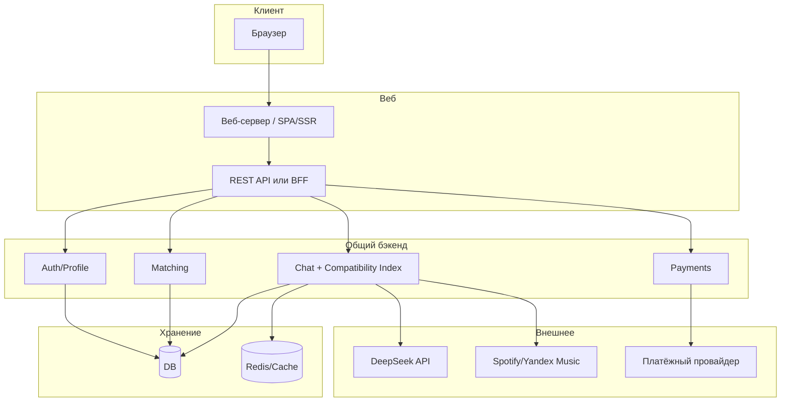

# Спецификация веб-приложения для знакомств

**Версия:** 1.0  
**Дата:** 2025-03-10

Веб-приложение является альтернативным клиентом к тому же сервису знакомств с механикой «Индекс совместимости», что и телеграм-бот. Спецификация бота — [spec.md](spec.md); детали механики индекса — [feature.md](feature.md).

---

## 0. Глоссарий

| Термин | Определение |
|--------|-------------|
| **Индекс совместимости** | Динамический показатель совместимости пары (0–100%), рассчитываемый по переписке; определяет уровень и разблокируемые функции. |
| **Пара (матч)** | Два пользователя, взаимно поставившие лайк; между ними создаётся чат и начинает считаться индекс. |
| **Уровень** | Порог индекса (0–15%, 16–30%, … 91–100%), от которого зависят статус пары и доступные фичи. |
| **Разблокировка** | Открытие функции при достижении уровня: плейлист, челленджи, облако воспоминаний, голосование, PDF. |
| **Бустер** | Платная временная опция ускорения роста индекса (например, x2 на 24 ч). |
| **DeepSeek API** | Единственный разрешённый в проекте ИИ-провайдер; используется для PRO-анализа диалогов, генерации вопросов и рекомендаций. |
| **Язык интерфейса (локаль)** | Выбор пользователя: русский или английский; определяет язык всех текстов интерфейса (меню, подсказки, уведомления). |
| **Геолокация** | Координаты пользователя (широта/долгота), получаемые по желанию через браузер (Geolocation API); используются для показа в ленте ближайших пользователей и расстояния до них (в км). |
| **Расстояние до пользователя** | Расстояние от текущего пользователя до карточки в ленте, вычисляемое по координатам (например, формула Haversine); отображается приближённо (например, «~2 км», «~15 км») для конфиденциальности. |
| **Сессия** | Состояние аутентификации пользователя в веб-приложении (cookie + серверный сессионный хранилище или JWT); срок жизни ограничен, продлевается при активности. |
| **SPA / SSR** | Single Page Application — клиентский рендеринг; Server-Side Rendering — рендеринг страниц на сервере; выбор влияет на SEO, первую загрузку и навигацию. |

---

## 1. Цели и целевая аудитория

- **Цель**: знакомства через веб с той же игровой механикой совместимости («Индекс совместимости»), удержание за счёт прогресса в паре и разблокировки уровней. Веб и телеграм-бот — один продукт: общий бэкенд, общая модель данных, единая логика индекса.
- **Аудитория**: те же пользователи 18+, ищущие лёгкие знакомства или отношения; веб даёт альтернативный вход для тех, кто предпочитает браузер телеграму.

---

## 2. Связь с телеграм-ботом

Веб-приложение и телеграм-бот являются частями одного сервиса. Пользователь веб-версии должен иметь возможность узнать о боте и перейти в него.

- **Обязательное требование**: в веб-интерфейсе должен присутствовать **пункт меню** (навигации), ведущий на телеграм-бота. Варианты подписи: «В Telegram», «Бот в Telegram», «Знакомства в Telegram». Пункт размещается в основной или дополнительной навигации (шапка, боковое меню, меню настроек), так чтобы он был **заметен**, но **не перекрывал основной контент** и не отвлекал навязчиво.
- Ссылка ведёт на URL вида `https://t.me/<bot_username>` (значение задаётся конфигурацией).
- **Опционально**: дополнительная ссылка на бота в футере страницы или на странице «О проекте» / в настройках профиля. Баннер не обязателен; при его использовании он должен оставаться ненавязчивым.

---

## 3. Архитектура веб-приложения

- **Клиент**: браузер (десктоп и мобильный); адаптивная вёрстка обязательна.
- **Веб-слой**: либо SPA (статический хостинг + отдельный API), либо SSR (рендеринг на сервере), либо гибрид (BFF + SPA). Выбор — по требованиям к SEO и первой загрузке.
- **API**: REST API (или BFF) с аутентификацией (сессии на cookie или JWT) и версионированием. API может быть общим с телеграм-ботом (как предусмотрено в п. 2.5 [spec.md](spec.md)) или выделенным для веб-клиента; граница между «Telegram-бот» и веб-клиентом остаётся чёткой на уровне шлюза.
- **Бэкенд**: общие сервисы — профили, матчинг, чаты, расчёт индекса совместимости, платежи. Состояние — в БД и Redis, не в памяти веб-сервера.
- **Внешние сервисы**: для ИИ — **только DeepSeek API**; опционально API музыки; веб-платёжный провайдер (карты, подписка).

### 3.1 Аутентификация веб-пользователя

- Вход **не через Telegram**: email + пароль и/или OAuth (Google, VK и т.д.). Регистрация по email с подтверждением (или через OAuth без отдельного пароля).
- Сессии: защищённые cookie (HttpOnly, Secure, SameSite) + серверное хранилище сессий (Redis/БД) или JWT с коротким сроком жизни и refresh-токеном. Защита от перехвата и CSRF.
- Опциональная **привязка к Telegram**: для пользователей, желающих пользоваться и веб, и ботом одним аккаунтом — привязка через Telegram Login Widget или код подтверждения; в профиле хранится `telegram_id` наряду с веб-учётными данными.

### 3.2 Масштабирование

- Горизонтальное масштабирование веб-сервера и API за балансировщиком; сессии в Redis или БД. Расчёт индекса — те же воркеры и очереди, что и для бота (см. [spec.md](spec.md), п. 2.1, 2.4).

---

## 4. Регистрация и аутентификация (веб)

- **Регистрация**: email (и/или OAuth), пароль при необходимости, выбор языка интерфейса (русский/английский), подтверждение возраста 18+, согласие с правилами и обработкой данных.
- **Выбор языка**: при первом входе или в настройках; все тексты веб-интерфейса (меню, кнопки, подсказки, уведомления) отображаются на выбранном языке. Смена языка — в настройках профиля.
- **Восстановление доступа**: сброс пароля по email (ссылка с ограниченным сроком действия).
- **Привязка Telegram**: опционально в настройках; после привязки пользователь может входить через бота тем же аккаунтом (если реализована единая модель пользователя с `telegram_id` и веб-учётными данными).

---

## 5. Анкета, поиск, матчинг, чаты (веб)

Функциональные требования совпадают с [spec.md](spec.md) (разделы 3.2–3.4); ниже — особенности веб-интерфейса.

### 5.1 Анкета пользователя

- **Обязательно**: имя/ник, возраст, пол, кого ищет (М/Ж/все), город или «не указывать». **Фото**: желательно одно; при регистрации без фото — допускается с ограничением видимости в ленте и напоминанием добавить фото позже.
- **Опционально**: краткое описание, интересы (теги), любимые фильмы/сериалы/музыка, знак зодиака.
- **Геолокация (опционально)**: запрос через браузерный Geolocation API; пользователь может разрешить, отклонить или отключить позже в настройках. Без геолокации карточки в ленте без расстояния и без приоритета по близости.
- Редактирование анкеты в любой момент в настройках профиля.

### 5.2 Поиск и матчинг (лента)

- **Лента**: карточки по фильтрам (возраст, пол, город). При включённой геолокации у обоих — сортировка по расстоянию и отображение приближённого расстояния («~2 км», «~15 км»); точные координаты и адреса не раскрываются.
- **Веб-интерфейс ленты**: карточки в виде блоков (десктоп — сетка или карусель, мобильная версия — свайпы влево/вправо). Свайп вправо — лайк, влево — пропуск; альтернатива — кнопки «Нравится» / «Пропустить».
- **Взаимный лайк** → создаётся пара (чат), оба получают уведомление (в веб — уведомление в интерфейсе и/или push при поддержке).
- Лимит лайков: **100 в день бесплатно**; расширение или снятие лимита — за подписку/донат (см. раздел 7).

### 5.3 Чаты (веб)

- Личный чат только между парой (после матча). Сообщения отправляются через веб-интерфейс, доставляются партнёру в реальном времени (long polling, WebSocket или аналог).
- **Обмен контактами**: кнопка «Обменяться контактами» в чате; при взаимном нажатии обоим показываются контактные данные. До обмена контакты не раскрываются.
- Поддержка: текст, фото (загрузка файла); голосовые и стикеры — по возможности (зависит от возможностей браузера и бэкенда).
- Жалобы, блокировка, **завершение чата**: кнопка «Завершить чат» переводит пару в статус «завершён», индекс не обновляется; оба снова появляются в ленте друг у друга; при повторном взаимном лайке — новый матч и новый индекс.
- **Визуал чата**: в шапке чата отображаются имя партнёра, возраст и **прогресс-бар индекса совместимости** с процентом (см. раздел 6 и [spec.md](spec.md) п. 4.1).

---

## 6. Индекс совместимости (веб)

Механика индекса совместимости **единая** с телеграм-ботом: расчёт на общем бэкенде, те же уровни и разблокировки. Детали расчёта и уровней — в [spec.md](spec.md) (раздел 4) и [feature.md](feature.md).

- В веб-чате: в шапке — прогресс-бар и процент (например: `Анна (23) ● Совместимость: [█████░░░░░] 47%`).
- Подсказки о росте индекса — редко; служебное сообщение в ленте чата — только при смене уровня (как в spec.md п. 4.1).
- Разблокировки (плейлист, челленджи, облако воспоминаний, голосование, PDF) отображаются и доступны в веб-интерфейсе при достижении соответствующих уровней индекса.

---

## 7. Монетизация (веб)

- **Базовая**: лимит 100 лайков в день бесплатно; снятие лимита, суперлайки — за подписку или разовый платёж.
- **Индекс совместимости**: бустер (ускорение роста индекса на 24 ч), секретный вопрос от ИИ, обезличенная аналитика стиля общения — по той же модели, что в [spec.md](spec.md) (раздел 5); без формулировок вида «нравишься на X%» или «искренность собеседника».
- **Платёжный провайдер для веб**: не Telegram Stars, а приём карт, подписка (Stripe, ЮKassa, и т.п.); учёт баланса/подписки в общей модели пользователя при едином аккаунте с ботом.

---

## 8. Данные и хранение

- Модель данных — общая с ботом ([spec.md](spec.md), раздел 6). В таблице **users** при поддержке веб-входа: поля для email (или идентификатора OAuth), хэша пароля (при наличии), а также опционально `telegram_id` для привязанного аккаунта. Поле **locale** (язык интерфейса) общее.
- **Геолокация**: получение через браузер (Geolocation API), хранение только актуальных координат; срок хранения и политика отключения — как в spec.md п. 6.2, 6.3.
- **Профили, пары, сообщения, индекс совместимости**: те же сущности и сроки хранения; удаление аккаунта (GDPR, право на забвение) — каскадное удаление/анонимизация и период «мягкого» удаления, как в spec.md п. 6.3.
- В настройках и при регистрации — явная кнопка «Удалить аккаунт» и ссылка на политику конфиденциальности.

---

## 9. Безопасность и модерация (веб)

- Принципы те же, что в [spec.md](spec.md) (раздел 7): обмен контактами только по взаимному согласию; геолокация — только приближённое расстояние в ленте; фильтрация оскорблений/спама; жалобы и блокировки; логирование без полного текста сообщений.
- **Веб-специфика**:
  - **HTTPS**: весь трафик по TLS.
  - **Защита сессий**: HttpOnly, Secure, SameSite для cookie; инвалидация при смене пароля и по истечении срока неактивности.
  - **CSRF**: токены или проверка Origin/Referer для изменяющих запросов.
  - **XSS**: экранирование вывода, Content-Security-Policy при необходимости; загрузка файлов — валидация типа и размера.
  - **Rate limiting**: лимиты на API по IP и по user_id (лента, лайки, сообщения в чате); при превышении — временная блокировка или капча.

---

## 10. Внешние интеграции

- **ИИ**: разрешён **только DeepSeek API** ([spec.md](spec.md) п. 8); сценарии PRO (анализ диалога, секретный вопрос, аналитика) — через DeepSeek.
- **Музыка (Spotify / Яндекс.Музыка)**: OAuth 2.0, хранение refresh-токенов в защищённом виде; при исчерпании квоты — корректное сообщение пользователю без падения сервиса.
- **Платежи**: веб-платёжный провайдер (карты, подписка) с соответствием PCI DSS при хранении/передаче платёжных данных.
- **Привязка Telegram**: при реализации единого аккаунта — Telegram Login Widget или иной механизм верификации; только для привязки, не для обязательного входа в веб.

---

## 11. Нефункциональные требования

- **Доступность**: целевой uptime в пределах SLA (например, 99,5%); мониторинг и алертинг — как в spec.md п. 9.
- **Задержка**: ответ API (лента, отправка сообщения, лайк) — p95 не более 2–3 сек; обновление индекса — не более 30–60 сек (общая очередь с ботом).
- **Адаптивность**: веб-интерфейс должен корректно отображаться и быть удобным на десктопе и на мобильных устройствах (адаптивная вёрстка, при необходимости — отдельные breakpoints для планшетов).

---

## 12. Обработка ошибок и граничные случаи

- Общие случаи из [spec.md](spec.md) (раздел 10): недоступность БД/Redis, таймаут DeepSeek, невалидный контент — те же меры (повтор с backoff, fallback расчёта индекса, не падать при необрабатываемом контенте).
- **Веб-специфика**:
  - **Сеть недоступна**: информирование пользователя («Проверьте подключение»), повтор запросов при восстановлении связи.
  - **401 Unauthorized / истечение сессии**: перенаправление на страницу входа с сохранением целевого URL для редиректа после успешной авторизации.
  - **403 Forbidden**: сообщение о недостатке прав, без раскрытия внутренней структуры.
  - **Отмена платежа / ошибка оплаты**: откат разблокировки или подписки, понятное сообщение пользователю.

---

## 13. Этапы реализации (дорожная карта) веб-версии

1. **MVP веб**: регистрация/вход (email+пароль или OAuth), анкета (в т.ч. опциональная геолокация и фото), лента карточек с лайками/пропусками, взаимный лайк → чат, отправка сообщений в чате, отображение индекса совместимости в шапке чата. **Пункт меню «В Telegram»** (или аналог) со ссылкой на бота — с первого релиза.
2. **Разблокировки и геймификация**: плейлист, челленджи, облако воспоминаний, голосование, PDF — в веб-интерфейсе при достижении уровней.
3. **Монетизация веб**: приём платежей (подписка, бустер, секретный вопрос, аналитика) через выбранный платёжный провайдер.
4. **Привязка к боту** (опционально): единый аккаунт для веб и Telegram (Telegram Login Widget, синхронизация профиля и чатов при необходимости).

---

## 14. Ключевые файлы и зоны реализации

- **Спецификация веб-приложения**: данный документ [web-dating.md](web-dating.md). Спецификация бота — [spec.md](spec.md); механика индекса — [feature.md](feature.md).
- **При разработке веб-версии**: клиент (роутинг, навигация с **обязательным пунктом меню на ссылку телеграм-бота**), страницы регистрации/входа, профиля/анкеты, ленты, чата (с прогресс-баром индекса); API-слой (REST или BFF) с аутентификацией; использование общих сервисов бэкенда (пользователи, матчинг, чаты, расчёт индекса). **Локализация**: все пользовательские тексты веб-интерфейса — русский и английский в зависимости от `locale` пользователя.

Спецификация готова к использованию как ТЗ для разработки веб-приложения для знакомств с фичей «Индекс совместимости» и связью с телеграм-ботом.
